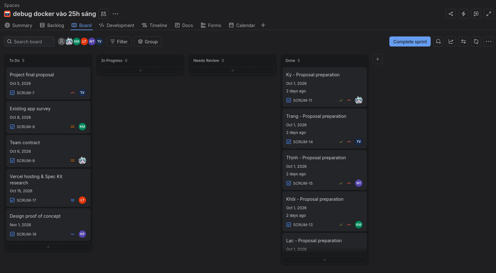

# Weekly Reports

## ======== Sprint 1 &mdash; 2/10 Planning meeting ========

### Presence
Team members present:
- Kỳ
- Lạc
- Thịnh
- Trang
- Khôi

Team members absent: None

### Status report - Kỳ
Completed tasks:
- Set up Jira (for upholding Scrum procedure), Git repo (for source control), and Discord (for communication between members)
- Divided preliminary proposal tasks for each member
- Completed individual project proposal

To-do tasks:
- Compose the team contract

Issues/Obstacles:
- Needed to learn and uphold Scrum methodology effectively
- Did a bit of research in the feasibility of a music maker UI, as well as useful tools for geological purposes

### Status reports - Lạc
Completed tasks:
- Completed individual project proposal

To-do tasks:
- Research into Spec Kit and Vercel

Issues/Obstacles:
- None

### Status reports - Thịnh
Completed tasks:
- Completed individual project proposal

To-do tasks:
- Design the application's proof of concept

Issues/Obstacles:
- None

### Status reports - Trang
Completed tasks:
- Completed individual project proposal

To-do tasks:
- Compose the final proper project proposal

Issues/Obstacles:
- None

### Status reports - Khôi
Completed tasks:
- Completed individual project proposal

To-do tasks:
- Do a survey on existing apps whose idea overlap with the proposed idea

Issues/Obstacles:
- None

### Actions
- The final proposal must be finalized and formalized.
- The remaining documents are to be completed.

### Summary
- Every member's ideas have been reviewed and cherry-picked to produce the most suitable and feasible idea.
- Other documents required is in progress.