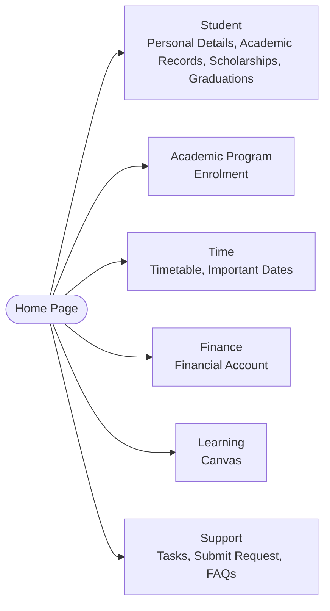
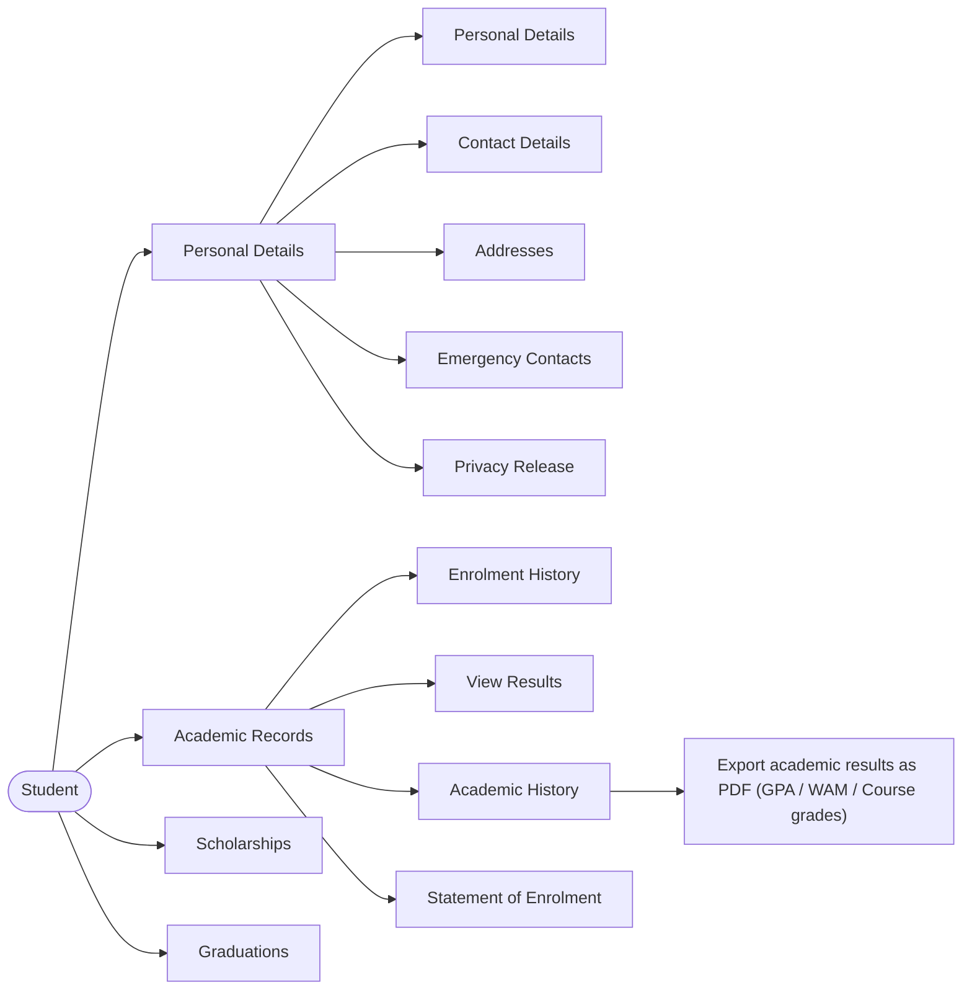
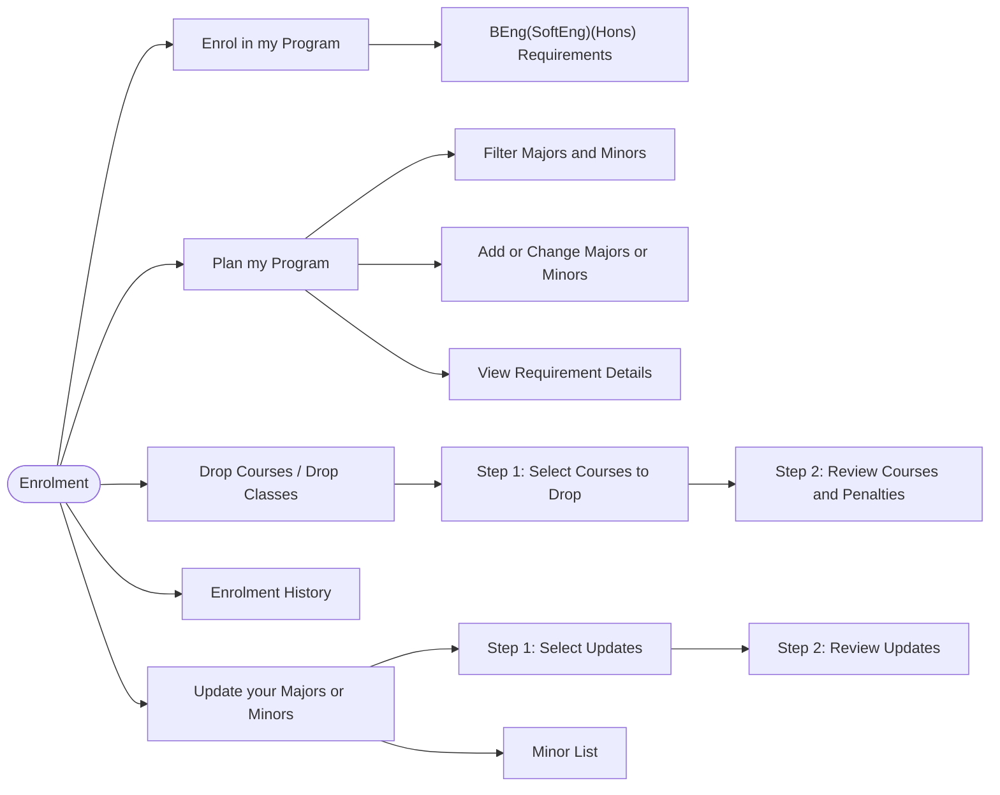
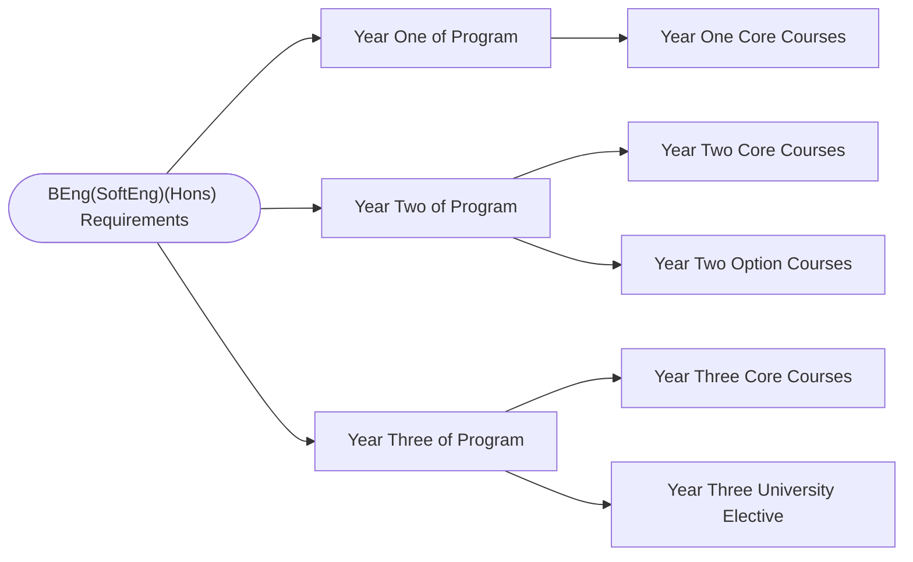
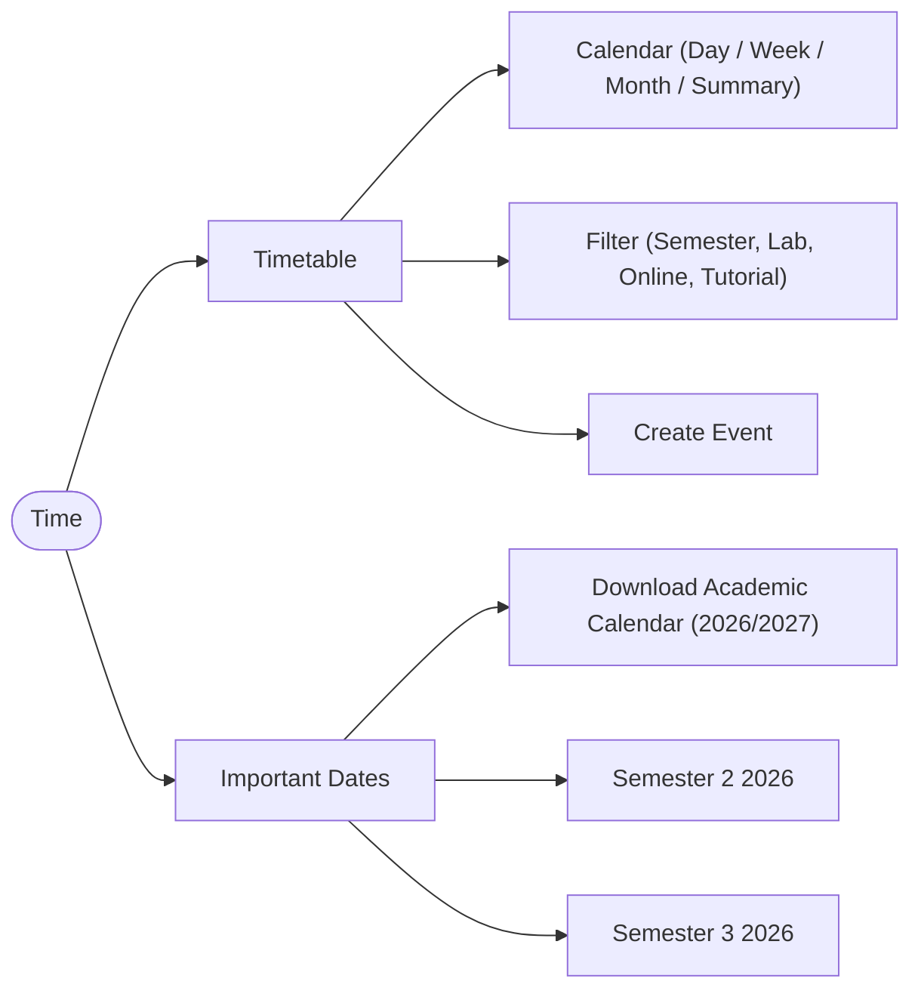
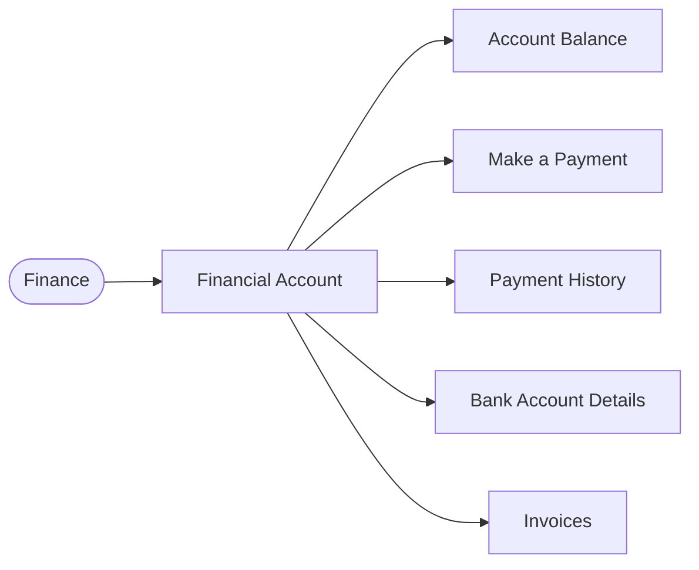
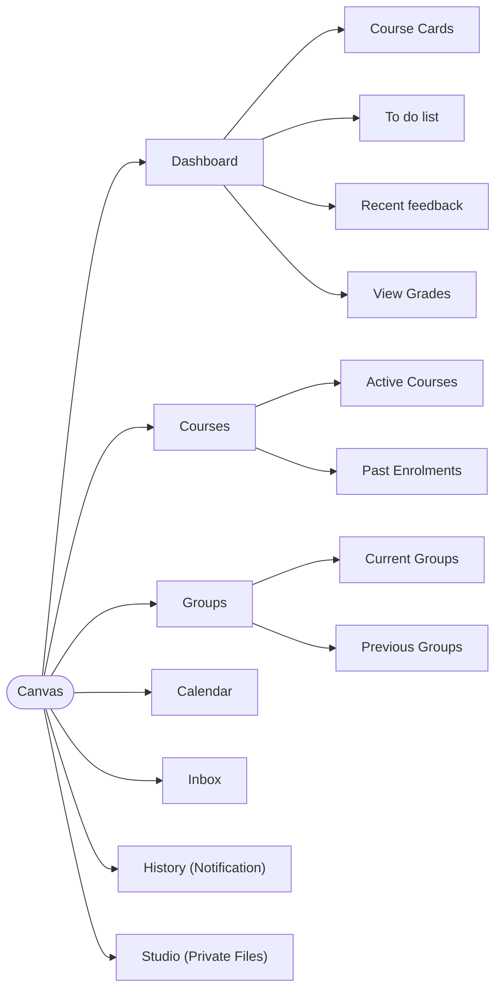
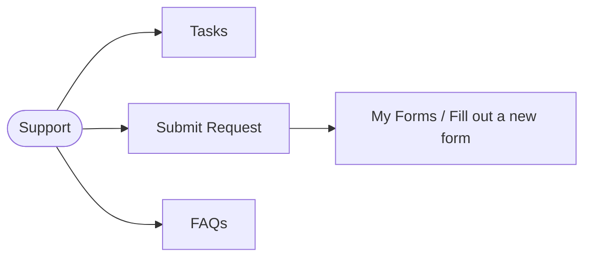

# Existing App Survey

This survey covers three existing websites that are similar to CampusHub: the RMIT LMS (student portal with Canvas), the UEH LMS, and the UEH conduct score website.

## App 1: RMIT LMS

| | |
|---|---|
| **Platform** | Website |
| **Purpose** | RMIT's student portal: enrollment, timetable, academic records, tuition payment, and student requests, with a link out to Canvas for course content |
| **Target users** | Students (the portal has almost no value for Teachers, apart from Canvas); Canvas supports Admin, Student and Teacher roles |
| **Main sections** | Tasks, Personal Details, Enrollment, Timetable, Academic Record, Financial Account, Important Dates, Canvas, Submit Request |

### Home Page

![][image1]

### Tasks

Complete forms (forms the university requires students to fill in)

### Personal Details

![][image2]

### Enrollment

![][image3] 

![][image4]  
![][image5]

- Review Courses and Penalties: This section is only displayed when the student has a violation.

![][image6]  
![][image7]

### Timetable

![][image8]

- The timetable is automatically updated with the class schedule when the student successfully enrolls in a course.

![][image9]

### Academic Record

![][image10]  
![][image11]  
Note: When the “\>” button is clicked, the system exports a PDF file, as illustrated below:

![][image12]

### Financial Account

![][image13]  
Note: When the student has tuition fees to pay, this page is displayed and lists the outstanding payments.  
Note: Students can enter their bank card details here to pay automatically.

### Important Dates

![][image14]

### Canvas

![][image15]  
![][image16]  
![][image17]

![][image18]  
![][image19]  
Note: The History section works like the Notification section in Moodle.  
Note: The Studio section works like Private Files in Moodle.  
Note: The Canvas section redirects to another link in a new tab. Role-based permissions (Admin, Student, Teacher) need to be studied carefully.

### Submit Request

![][image20]  
![][image21]  
Note: This is where students send requests to the university.

### Review 

- The system is similar to the team's current portal, with Canvas added (the equivalent of the team's Moodle).  
- It has many features worth borrowing, such as: the timetable updating automatically when course enrollment succeeds, online tuition payment, exporting academic results as a PDF, etc.  
- Limitations: There is no conduct score system; the system has almost no value for the Teacher role (apart from Canvas).

### Component Tree (Mermaid)

The full RMIT portal tree is split by feature group. The overview shows how the groups hang off the Home Page, and each group has its own diagram below.

#### Overview

#### 1. Student

#### 2. Academic Program (Enrolment)

Program requirements (expanded from "Enrol in my Program"):

#### 3. Time

#### 4. Finance

#### 5. Learning (Canvas)

#### 6. Support

## App 2: UEH LMS

| | |
|---|---|
| **Platform** | Website |
| **Purpose** | The learning management system of UEH (University of Economics Ho Chi Minh City), which appears to be Moodle-based, used for course content, exams and learning activities |
| **Target users** | Students, Teachers (lecturers) and Admins, each with a separate view |
| **Main sections** | Home Page, UEH Shop, Quick Access to My Folders, Midterm Exam (students / lecturers), SEB Practice Exam, Dashboard |

### Home Page (Also the “UEH LMS” tab)  
![][image22]  
![][image23]  
![][image24]  
![][image25]  
(End of Home Page)

### UEH Shop  
![][image26]  
Note: This section redirects to another tab with a different URL.

### Quick Access to My Folders (Đến nhanh thư mục của tôi)  
![][image27]  
Note: The “Quick Access to My Folders” tab does not change color when selected; the other tabs have the same issue.

### Midterm Exam for Students (Thi giữa kỳ cho sinh viên)  
![][image28]   
Note: This section only provides instructions; it contains no exam paper.

### Midterm Exam for Lecturers (Thi giữa kỳ cho GV)  
![][image29]  
Note: The content is similar to the “Midterm Exam for Students” tab.

### SEB Practice Exam (Thi thử SEB)  
![][image30]

### Dashboard (Bảng điều khiển)

(The official name of this tab has not been identified; clicking “Dashboard” (“Bảng điều khiển”) redirects the user to this page.)  
![][image31]

### Review 

- Strengths: Clear distinction between the Admin, Teacher and Student roles.  
- Limitations: Poor user experience (UX) and a cluttered interface. Too much information is placed on the same page (for example, the Homepage alone contains components of other tabs).

## App 3: UEH Conduct Score Website

| | |
|---|---|
| **Platform** | Website |
| **Purpose** | A dedicated website for everything related to conduct scoring (điểm rèn luyện) of UEH students |
| **Target users** | UEH students (profile, activity registration, score tracking, appeals, QR check-in) |
| **Main sections** | Dashboard, Activities, Requests, Conduct Score, Profile, Utilities |

### Homepage 

![][image32]

### Dashboard

![][image33]  
![][image34]

### Activities

- All activities

![][image35]  
![][image36]  
Note: The activity statuses include: “Approved”, “In progress”, “Awaiting participant list update”, “Registration open”, etc.  
![][image37]

- Activities open for registration

![][image38]

### Requests

- Evidence documents for activities outside UEH

![][image39]  
![][image40]  
![][image41]

- GreenCampus score appeal 

![][image42]

- Conduct score appeal

![][image43]  
![][image44]

### Conduct Score

- Current semester score:

![][image45]  
![][image46]  
![][image47]  
![][image48]

- Full-course history

![][image49]  
![][image50]  
![][image51]

### Profile

(This page displays the student's personal information, so no screenshot is attached.)

### Utilities

- QR check-in scan

![][image52]

- Check-in history

![][image53]

### Review 

- Strengths: The user interface (UI) and user experience (UX) are intuitive, easy to use and convenient.  
- Weaknesses: None identified yet.

## Comparison Summary

### Features the existing apps have in common

Legend: $\checkmark$ = Found, - = not observed in the screenshots.

| Feature | RMIT LMS | UEH LMS | UEH Conduct Score |
|---|---|---|---|
| Role-based access (Admin / Teacher / Student) | $\checkmark$ (Canvas) | $\checkmark$ | - (student view only) |
| Personal profile / details | $\checkmark$ Personal Details | - | $\checkmark$ Profile |
| Course content and learning tools | $\checkmark$ via Canvas | $\checkmark$ folders, midterm exam, SEB practice exam | - |
| Timetable / calendar | $\checkmark$ Day / Week / Month views, filters, create event; Canvas Calendar | $\checkmark$ Homepage | - |
| Notifications / messaging | $\checkmark$ Canvas History and Inbox | - | - |
| Dashboard with an overview of tasks | $\checkmark$ Tasks, Canvas Dashboard (to-do, recent feedback) | $\checkmark$ Dashboard | $\checkmark$ Dashboard |
| Submitting requests / appeals to the university | $\checkmark$ Submit Request | - | $\checkmark$ Requests (evidence, score appeals) |
| Campus activities and registration | - | - | $\checkmark$ Activities with statuses, QR check-in |
| Academic results and records | $\checkmark$ Academic Record with PDF export | - | $\checkmark$ Conduct score (current semester and full history) |
| Online payment | $\checkmark$ Financial Account | - | - |
| Library room booking | - | - | - |
| Academic or student community (posts, Q&A, sharing) | - (Canvas Groups and Inbox are course-level only) | - | - |
| AI assistant | - | - | - |

Common ground:

- **Role-based access.** Each system shows different content depending on who is logged in.
- **A central dashboard** that points the user to what needs attention.
- **A structured way to send requests to the university** (RMIT Submit Request, Conduct Score appeals).
- **A record of the student's history**: enrollment history and academic results at RMIT, conduct score history at the conduct site.

Each app covers only one slice of student life. A UEH student today already needs two separate systems (the LMS and the conduct score site) and still has no room booking, community or AI support.

### What CampusHub will do differently or better

1. **One platform instead of several.** The three surveyed sites are separate systems with separate logins and URLs. Even inside them, features open in another tab or on another URL (UEH Shop, Canvas). CampusHub keeps courses, calendar, activities and community behind one login and one navigation.
2. **Library room booking.** None of the three apps lets students or lecturers search for rooms by date, time and capacity, then book or cancel. Staff can manage availability in the same place.
3. **Academic Community and Student Community.** The surveyed apps have no faculty or campus-wide spaces for Q&A, sharing study notes and past exams, buy/swap/giveaway posts, or lost-and-found. RMIT Canvas Groups and Inbox only cover a single course.
4. **A truly unified calendar.** The RMIT timetable shows classes and personal events. Canvas has a separate calendar, and the conduct site lists activities elsewhere. CampusHub puts classes, assignment deadlines, exams, study sessions and campus activities in one calendar, with reminders.
5. **Campus activities connected to the rest of the platform.** The conduct site covers activities and scores well but only on its own. CampusHub keeps activities in the calendar and tracks the extracurricular points they earn, while staff create activities and manage registrations.
6. **An AI Student Assistant.** None of the apps help students find information or choose what to do next. CampusHub's assistant answers questions such as what to do when a student ID card is lost, and recommends activities based on interests or points needed.
7. **A real role for lecturers.** The RMIT portal is almost useless for Teachers outside Canvas. CampusHub gives lecturers course content and announcements, scheduling for classes and exams, and room booking.
8. **A cleaner interface.** The UEH LMS homepage is cluttered and mixes components from other tabs, and its navigation tabs do not show which one is active. CampusHub gives each feature its own page and a clear active-state navigation bar.

### UI/UX patterns we plan to adopt

| Pattern | Source | How we will use it |
|---|---|---|
| Timetable that updates automatically after an action succeeds | RMIT LMS (timetable after enrollment) | Course enrollment, activity registration and room bookings appear in the calendar automatically |
| Calendar with Day / Week / Month views, filters and "create event" | RMIT LMS Timetable | The core of the Calendar and Planner feature, with filters (classes, deadlines, activities, personal) |
| Two-step flows with a review step before confirming | RMIT LMS (Drop Courses: select, then review) | Room booking and activity registration: select, review, confirm |
| Sections that appear only when relevant | RMIT LMS (Review Courses and Penalties, Financial Account) | Show alerts and action items only when they apply, which keeps the dashboard short |
| Dashboard with course cards, to-do list and recent feedback | RMIT LMS Canvas Dashboard | Student home page: courses, upcoming deadlines, announcements |
| Export records as PDF | RMIT LMS Academic Record | Export a student's activity participation and extracurricular points record |
| Separate Submit Request area | RMIT LMS, UEH Conduct Score (Requests) | A single place for requests and appeals, with evidence upload |
| Clear separation of Admin / Teacher / Student views | UEH LMS | Role-based access for students, lecturers and staff |
| Status tags and "open for registration" filter | UEH Conduct Score (Activities) | Campus Activities list with statuses and filters |
| QR check-in and check-in history | UEH Conduct Score (Utilities) | Attendance at campus activities, feeding the participation records |
| Current-semester score plus full-course history | UEH Conduct Score (Conduct Score) | Extracurricular points view for students |
| Short, intuitive top-level navigation (Dashboard, Activities, Requests, Score, Profile, Utilities) | UEH Conduct Score | Navigation structure for the whole app |

Patterns we plan to avoid:

- **Cluttered homepage** that holds components of other tabs (UEH LMS).
- **Navigation with no active-state highlight** (UEH LMS).
- **Features that open in a new tab on a different URL** (UEH Shop, RMIT Canvas), which breaks the sense of one platform.

[image1]: img/RMIT_LMS_HomePage.png
[image2]: img/RMIT_LMS_PersonalDetails.png
[image3]: img/RMIT_LMS_Enrollment_0.png
[image4]: img/RMIT_LMS_Enrollment_1.png
[image5]: img/RMIT_LMS_Enrollment_2.png
[image6]: img/RMIT_LMS_EnrollmentPenaltyReview_0.png
[image7]: img/RMIT_LMS_EnrollmentPenaltyReview_1.png
[image8]: img/RMIT_LMS_Timetable_0.png
[image9]: img/RMIT_LMS_Timetable_1.png
[image10]: img/RMIT_LMS_AcademicRecord_0.png
[image11]: img/RMIT_LMS_AcademicRecord_1.png
[image12]: img/RMIT_LMS_AcademicRecordPDF.png
[image13]: img/RMIT_LMS_FinancialAccount.png
[image14]: img/RMIT_LMS_ImportantDates.png
[image15]: img/RMIT_LMS_Canvas_0.png
[image16]: img/RMIT_LMS_Canvas_1.png
[image17]: img/RMIT_LMS_Canvas_2.png
[image18]: img/RMIT_LMS_Canvas_3.png
[image19]: img/RMIT_LMS_Canvas_4.png
[image20]: img/RMIT_LMS_SubmitRequest_0.png
[image21]: img/RMIT_LMS_SubmitRequest_1.png
[image22]: img/UEH_LMS_HomePage_0.png
[image23]: img/UEH_LMS_HomePage_1.png
[image24]: img/UEH_LMS_HomePage_2.png
[image25]: img/UEH_LMS_HomePage_3.png
[image26]: img/UEH_LMS_UEHShop.png
[image27]: img/UEH_LMS_QuickAccessMyFolders.png
[image28]: img/UEH_LMS_MidtermExamStudent.png
[image29]: img/UEH_LMS_MidtermExamLecturer.png
[image30]: img/UEH_LMS_SEBPracticeExam.png
[image31]: img/UEH_LMS_Dashboard.png
[image32]: img/UEH_Conduct_HomePage.png
[image33]: img/UEH_Conduct_Dashboard_0.png
[image34]: img/UEH_Conduct_Dashboard_1.png
[image35]: img/UEH_Conduct_ActivitiesAll_0.png
[image36]: img/UEH_Conduct_ActivitiesAll_1.png
[image37]: img/UEH_Conduct_ActivitiesAll_2.png
[image38]: img/UEH_Conduct_ActivitiesOpenRegistration.png
[image39]: img/UEH_Conduct_RequestsEvidence_0.png
[image40]: img/UEH_Conduct_RequestsEvidence_1.png
[image41]: img/UEH_Conduct_RequestsEvidence_2.png
[image42]: img/UEH_Conduct_RequestsGreenCampusAppeal.png
[image43]: img/UEH_Conduct_RequestsConductScoreAppeal_0.png
[image44]: img/UEH_Conduct_RequestsConductScoreAppeal_1.png
[image45]: img/UEH_Conduct_ScoreCurrentSemester_0.png
[image46]: img/UEH_Conduct_ScoreCurrentSemester_1.png
[image47]: img/UEH_Conduct_ScoreCurrentSemester_2.png
[image48]: img/UEH_Conduct_ScoreCurrentSemester_3.png
[image49]: img/UEH_Conduct_ScoreHistory_0.png
[image50]: img/UEH_Conduct_ScoreHistory_1.png
[image51]: img/UEH_Conduct_ScoreHistory_2.png
[image52]: img/UEH_Conduct_UtilitiesQRCheckIn.png
[image53]: img/UEH_Conduct_UtilitiesCheckInHistory.png
