# Home Page

![][image1]

# Task

Làm Form (Form trường yêu cầu sv điền) 

# Personal Details

![][image2]

# Enrollment

![][image3] 

![][image4]  
![][image5]

- Review Courses and Penalties: Mục này chỉ hiển thị khi sinh viên có vi phạm.

![][image6]  
![][image7]

# Timetable

![][image8]

- Timetable tự động cập nhật lịch học khi sinh viên đăng ký môn học thành công.

![][image9]

# Academic Record

![][image10]  
![][image11]  
Note: Khi nhấn vào nút “\>”, hệ thống sẽ xuất tệp PDF như minh họa dưới đây:

![][image12]

# Financial Account

![][image13]  
Note: Khi sinh viên có học phí cần đóng, trang này sẽ hiển thị và liệt kê các khoản phải thanh toán.  
Note: Sinh viên có thể nhập thông tin thẻ ngân hàng tại đây để thanh toán tự động.

# Important Dates

![][image14]

# Canvas

![][image15]  
![][image16]  
![][image17]

![][image18]  
![][image19]  
Note: Mục History có chức năng tương tự mục thông báo (Notification) của Moodle.  
Note: Mục Studio có chức năng tương tự Private Files của Moodle.  
Note: Mục Canvas chuyển hướng sang một liên kết khác trong tab mới. Cần nghiên cứu kỹ khi phân quyền theo vai trò (Admin, Student, Teacher).

# Submit Request

![][image20]  
![][image21]  
Note: Đây là nơi sinh viên gửi yêu cầu đến nhà trường.

# Nhận xét (tldr)

- Hệ thống tương tự portal hiện tại của nhóm, bổ sung thêm Canvas (tính năng tương đương Moodle của nhóm).  
- Có nhiều tính năng đáng tham khảo như: lịch học tự động cập nhật khi đăng ký môn học thành công, thanh toán học phí trực tuyến, xuất kết quả học tập dưới dạng PDF, v.v.  
- Hạn chế: Không có hệ thống điểm rèn luyện; hệ thống hầu như không có giá trị sử dụng đối với vai trò Teacher (ngoại trừ Canvas).

# Component Tree (Mermaid)

```mermaid
graph TD
    Root["Home Page"]

    %% Level 1
    Root --> Tasks["1. Tasks"]
    Root --> Personal["2. Personal Details"]
    Root --> Enrolment["3. Enrolment"]
    Root --> Timetable["4. Timetable"]
    Root --> Academic["5. Academic Records"]
    Root --> Financial["6. Financial Account"]
    Root --> Scholarships["7. Scholarships"]
    Root --> Graduations["8. Graduations"]
    Root --> ImpDates["9. Important Dates"]
    Root --> Canvas["10. Canvas"]
    Root --> SubmitReq["11. Submit Request"]
    Root --> FAQs["12. FAQs"]

    %% 1. Tasks
    %% Tasks --> TaskForm["Làm Form theo yêu cầu trường"]

    %% 2. Personal Details
    Personal --> PD_Personal["Personal Details"]
    Personal --> PD_Contact["Contact Details"]
    Personal --> PD_Address["Addresses"]
    Personal --> PD_Emergency["Emergency Contacts"]
    Personal --> PD_Privacy["Privacy Release"]

    %% 3. Enrolment
    Enrolment --> Enrol_Program["Enrol in my Program"]
    Enrolment --> Enrol_Plan["Plan my Program"]
    Enrolment --> Enrol_Drop["Drop Courses / Drop Classes"]
    Enrolment --> Enrol_History["Enrolment History"]
    Enrolment --> Enrol_UpdateMM["Update your Majors or Minors"]

    Enrol_Program --> Program_Req["BEng(SoftEng)(Hons) Requirements"]
    Program_Req --> Y1["Year One of Program"]
    Y1 --> Y1_Core["Year One Core Courses"]
    Program_Req --> Y2["Year Two of Program"]
    Y2 --> Y2_Core["Year Two Core Courses"]
    Y2 --> Y2_Opt["Year Two Option Courses"]
    Program_Req --> Y3["Year Three of Program"]
    Y3 --> Y3_Core["Year Three Core Courses"]
    Y3 --> Y3_Elec["Year Three University Elective"]

    Enrol_Plan --> Plan_Filter["Filter Majors and Minors"]
    Enrol_Plan --> Plan_AddChange["Add or Change Majors or Minors"]
    Enrol_Plan --> Plan_Req["View Requirement Details"]

    Enrol_Drop --> Drop_S1["Step 1: Select Courses to Drop"]
    Enrol_Drop --> Drop_S2["Step 2: Review Courses and Penalties"]

    Enrol_UpdateMM --> MM_S1["Step 1: Select Updates"]
    Enrol_UpdateMM --> MM_S2["Step 2: Review Updates"]
    Enrol_UpdateMM --> MM_List["Minor List"]

    %% 4. Timetable
    Timetable --> TT_View["Calendar (Day / Week / Month / Summary)"]
    Timetable --> TT_Filter["Filter (Semester, Lab, Online, Tutorial)"]
    Timetable --> TT_Create["Create Event"]

    %% 5. Academic Records
    Academic --> AR_EnrolHistory["Enrolment History"]
    Academic --> AR_ViewResults["View Results"]
    Academic --> AR_History["Academic History"]
    Academic --> AR_Statement["Statement of Enrolment"]

    AR_History --> AR_PDF["Xuất file PDF kết quả học tập (GPA / WAM / Điểm môn học)"]

    %% 6. Financial Account
    Financial --> Fin_Balance["Account Balance"]
    Financial --> Fin_MakePay["Make a Payment"]
    Financial --> Fin_PayHistory["Payment History"]
    Financial --> Fin_BankDetails["Bank Account Details"]
    Financial --> Fin_Invoices["Invoices"]

    %% 9. Important Dates
    ImpDates --> ID_Download["Download Academic Calendar (2026/2027)"]
    ImpDates --> ID_Sem2["Semester 2 2026"]
    ImpDates --> ID_Sem3["Semester 3 2026"]

    %% 10. Canvas
    Canvas --> Canvas_Dash["Dashboard"]
    Canvas --> Canvas_Courses["Courses"]
    Canvas --> Canvas_Groups["Groups"]
    Canvas --> Canvas_Cal["Calendar"]
    Canvas --> Canvas_Inbox["Inbox"]
    Canvas --> Canvas_Hist["History (Notification)"]
    Canvas --> Canvas_Studio["Studio (Private Files)"]

    Canvas_Dash --> Dash_Cards["Course Cards"]
    Canvas_Dash --> Dash_ToDo["To do list"]
    Canvas_Dash --> Dash_Feedback["Recent feedback"]
    Canvas_Dash --> Dash_Grades["View Grades"]

    Canvas_Courses --> Course_Active["Active Courses"]
    Canvas_Courses --> Course_Past["Past Enrolments"]

    Canvas_Groups --> Group_Curr["Current Groups"]
    Canvas_Groups --> Group_Prev["Previous Groups"]

    %% 11. Submit Request
    SubmitReq --> SR_Forms["My Forms / Fill out a new form"]
```

# Home Page (Also the “UEH LMS” tab)  
![][image22]  
![][image23]  
![][image24]  
![][image25]  
(End of Home Page)

# UEH Shop  
![][image26]  
Note: Mục này chuyển hướng sang một tab khác với đường dẫn (URL) khác.

# Đến nhanh thư mục của tôi  
![][image27]  
Note: Tab “Đến nhanh thư mục của tôi” không thay đổi màu sắc khi được chọn; các tab khác cũng gặp tình trạng tương tự.

# Thi giữa kỳ cho sinh viên  
![][image28]   
Note: Mục này chỉ cung cấp hướng dẫn, không có đề thi.

# Thi giữa kỳ cho GV  
![][image29]  
Note: Nội dung tương tự tab “Thi giữa kỳ cho sinh viên”.

# Thi thử SEB  
![][image30]

# Bảng điều khiển

(Chưa xác định được tên chính thức của tab này; khi nhấn vào “Bảng điều khiển”, hệ thống sẽ chuyển hướng đến trang này.)  
![][image31]

# Nhận xét (tldr)

- Điểm mạnh: Phân biệt rõ ràng các vai trò Admin, Teacher và Student.  
- Hạn chế: Trải nghiệm người dùng (UX) chưa tốt, giao diện thiếu gọn gàng. Quá nhiều thông tin được đặt trong cùng một trang (ví dụ: riêng Homepage đã chứa các thành phần của những tab khác).

# Homepage 

![][image32]

# Dashboard

![][image33]  
![][image34]

# Hoạt động

- Tất cả hoạt động

![][image35]  
![][image36]  
Note: Các trạng thái hoạt động gồm: “Đã duyệt”, “Đang tổ chức”, “Chờ cập nhật danh sách”, “Đang mở đăng ký”, v.v.  
![][image37]

- Hoạt động đang mở đăng ký 

![][image38]

# Yêu cầu

- Hồ sơ minh chứng hoạt động ngoài UEH

![][image39]  
![][image40]  
![][image41]

- Phúc khảo GreenCampus 

![][image42]

- Phúc khảo đrl

![][image43]  
![][image44]

# Điểm rèn luyện

- Điểm học kỳ hiện tại:

![][image45]  
![][image46]  
![][image47]  
![][image48]

- Lịch sử toàn khóa

![][image49]  
![][image50]  
![][image51]

# Hồ sơ 

(Trang này hiển thị thông tin cá nhân của sinh viên nên không đính kèm ảnh chụp.)

# Tiện ích

- Quét QR check-in

![][image52]

- Lịch sử check-in

![][image53]

# Nhận xét (tldr)

- Điểm mạnh: Giao diện (UI) và trải nghiệm người dùng (UX) trực quan, dễ sử dụng và tiện lợi.  
- Điểm yếu: Chưa xác định được.

[image1]: img/Screenshot%202026-10-02%20211821.png
[image2]: img/Screenshot%202026-10-02%20212144.png
[image3]: img/Screenshot%202026-10-02%20212506.png
[image4]: img/Screenshot%202026-10-02%20212639.png
[image5]: img/Screenshot%202026-10-02%20212732.png
[image6]: img/Screenshot%202026-10-02%20212858.png
[image7]: img/Screenshot%202026-10-02%20213451.png
[image8]: img/Screenshot%202026-10-02%20213648.png
[image9]: img/Screenshot%202026-10-02%20214351.png
[image10]: img/Screenshot%202026-10-02%20214718.png
[image11]: img/Screenshot%202026-10-02%20214827.png
[image12]: img/Screenshot%202026-10-02%20214945.png
[image13]: img/Screenshot%202026-10-02%20215100.png
[image14]: img/Screenshot%202026-10-02%20215559.png
[image15]: img/Screenshot%202026-10-02%20215723.png
[image16]: img/Screenshot%202026-10-02%20215820.png
[image17]: img/Screenshot%202026-10-02%20215848.png
[image18]: img/Screenshot%202026-10-02%20215923.png
[image19]: img/Screenshot%202026-10-02%20215946.png
[image20]: img/Screenshot%202026-10-02%20220454.png
[image21]: img/Screenshot%202026-10-02%20220555.png
[image22]: img/Screenshot%202026-10-04%20140959.png
[image23]: img/Screenshot%202026-10-04%20141115.png
[image24]: img/Screenshot%202026-10-04%20141211.png
[image25]: img/Screenshot%202026-10-04%20141235.png
[image26]: img/Screenshot%202026-10-04%20141459.png
[image27]: img/Screenshot%202026-10-04%20141637.png
[image28]: img/Screenshot%202026-10-04%20141841.png
[image29]: img/Screenshot%202026-10-04%20142109.png
[image30]: img/Screenshot%202026-10-04%20142219.png
[image31]: img/Screenshot%202026-10-04%20142403.png
[image32]: img/Screenshot%202026-10-04%20171710.png
[image33]: img/Screenshot%202026-10-04%20174700.png
[image34]: img/Screenshot%202026-10-04%20174736.png
[image35]: img/Screenshot%202026-10-04%20174842.png
[image36]: img/Screenshot%202026-10-04%20180635.png
[image37]: img/Screenshot%202026-10-04%20180829.png
[image38]: img/Screenshot%202026-10-04%20181438.png
[image39]: img/Screenshot%202026-10-04%20181846.png
[image40]: img/Screenshot%202026-10-04%20181903.png
[image41]: img/Screenshot%202026-10-04%20181938.png
[image42]: img/Screenshot%202026-10-04%20182040.png
[image43]: img/Screenshot%202026-10-04%20182209.png
[image44]: img/Screenshot%202026-10-04%20182235.png
[image45]: img/Screenshot%202026-10-04%20182420.png
[image46]: img/Screenshot%202026-10-04%20182524.png
[image47]: img/Screenshot%202026-10-04%20182555.png
[image48]: img/Screenshot%202026-10-04%20182739.png
[image49]: img/Screenshot%202026-10-04%20182859.png
[image50]: img/Screenshot%202026-10-04%20182929.png
[image51]: img/Screenshot%202026-10-04%20182944.png
[image52]: img/Screenshot%202026-10-04%20183204.png
[image53]: img/Screenshot%202026-10-04%20183257.png
